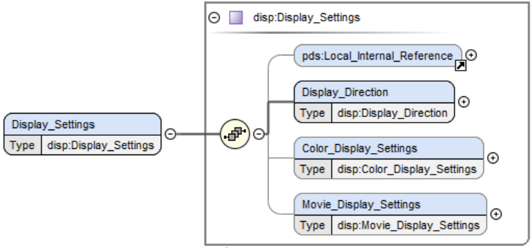
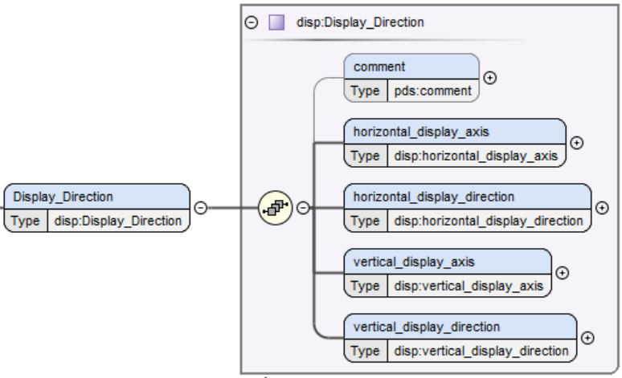

# Display (disp) Discipline Namespace User’s Guide
May 7, 2024
Trent Hare

# Introduction
   1. Overview of the Display Discipline Namespace
   1. Organization of Classes and Attributes
   1. Examples

# Overview of the Display Discipline Namespace

The _Display_ namespace is used to define how an array-type object with two or more dimensions should be displayed on, for example, a computer monitor or video screen.

# Organization of Classes and Attributes
The overall design for the DISPLAY dictionary is small and relatively straight forward. There a 5 classes and a little over a dozen attributes. The top level class \<disp:Display_Settings\> requires at least one Local_Internal_Reference \<pds:Local_Internal_reference\> and one \<disp:Display_Direction\> class. \<pds:Local_Internal_reference\> can be used multiple times if the label contains several "Array_*" sections which have the same defined directions.


>_Figure 1. shows the top level \<disp:Display_Settings> which requires at least one Local_Internal_Reference \<pds:Local_Internal_reference> and one \<disp:Display_Direction\>. The last two classes shown are optional._ 

## Display_Direction Class

The \<disp:Display_Direction\> class identifies the 2D image plane and how it should be displayed using attributes like "Top to Bottom" and "Left to Right". 


>_Figure 2. shows the mandatory \<disp:Display_Direction\> and the 4 mandatory attributes with the class._ 

## Color_Display_Settings

The first optional class \<disp:Color_Display_Settings\> is used to identify red, blue, and green channels to display a color composite.

## Color_Movie_Settings

The second optional class \<disp:Movie_Display_Settings\> is used to identify any timing information to display an image cube as an animation or movie. Several looping attributes are optional to define looping count or looping delay time.

# Examples

## Color Image Example

```
...
      <disp:Display_Settings>
        <Local_Internal_Reference>
          <local_identifier_reference>colorarray</local_identifier_reference>
          <local_reference_type>display_settings_to_array</local_reference_type>
        </Local_Internal_Reference>
        <disp:Display_Direction>
          <disp:horizontal_display_axis>Line</disp:horizontal_display_axis>
          <disp:horizontal_display_direction>Left to Right</disp:horizontal_display_direction>
          <disp:vertical_display_axis>Sample</disp:vertical_display_axis>
          <disp:vertical_display_direction>Top to Bottom</disp:vertical_display_direction>
        </disp:Display_Direction>
        <disp:Color_Display_Settings>
          <disp:color_display_axis>Band</disp:color_display_axis>
          <disp:red_channel_band>1</disp:red_channel_band>
          <disp:green_channel_band>2</disp:green_channel_band>
          <disp:blue_channel_band>3</disp:blue_channel_band>
        </disp:Color_Display_Settings>
      </disp:Display_Settings>
...
```

## Minimal Image Example with Array

```
  </Observation_Area>
...
    <Discipline_Area>
      <disp:Display_Settings>
        <Local_Internal_Reference>
          <local_identifier_reference>array2d</local_identifier_reference>
          <local_reference_type>display_settings_to_array</local_reference_type>
        </Local_Internal_Reference>
        <disp:Display_Direction>
          <disp:horizontal_display_axis>Line</disp:horizontal_display_axis>
          <disp:horizontal_display_direction>Left to Right</disp:horizontal_display_direction>
          <disp:vertical_display_axis>Sample</disp:vertical_display_axis>
          <disp:vertical_display_direction>Top to Bottom</disp:vertical_display_direction>
        </disp:Display_Direction>
      </disp:Display_Settings>
    </Discipline_Area>
  </Observation_Area>
  <File_Area_Observational>
    <File>
      <file_name>my_image2d.img</file_name>
      <local_identifier>image2d</local_identifier> 
      <creation_date_time>2024-05-30T08:45:08.15Z</creation_date_time> 
      <file_size unit="byte">7760</file_size> 
    </File>
    <Array_2D_Image>
      <local_identifier>image2d</local_identifier>
        <offset unit="byte">0</offset>
        <axes>2</axes>
        <axis_index_order>Last Index Fastest</axis_index_order>
        <Element_Array>
        <data_type>IEEE754LSBSingle</data_type>
      </Element_Array>
      <Axis_Array>
        <axis_name>Line</axis_name>
        <elements>720</elements>
        <sequence_number>1</sequence_number>
      </Axis_Array>
      <Axis_Array>
        <axis_name>Sample</axis_name>
        <elements>1440</elements>
        <sequence_number>2</sequence_number>
      </Axis_Array>
    </Array_2D_Image>
  </File_Area_Observational>
</Product_Observational>
```

## Example for a Looping Animation

```
...
      <disp:Display_Settings>
        <Local_Internal_Reference>
          <local_identifier_reference>animation</local_identifier_reference>
          <local_reference_type>display_settings_to_array</local_reference_type>
        </Local_Internal_Reference>
        <disp:Display_Direction>
          <disp:horizontal_display_axis>Line</disp:horizontal_display_axis>
          <disp:horizontal_display_direction>Left to Right</disp:horizontal_display_direction>
          <disp:vertical_display_axis>Sample</disp:vertical_display_axis>
          <disp:vertical_display_direction>Top to Bottom</disp:vertical_display_direction>
        </disp:Display_Direction>
        <disp:Movie_Display_Settings>
          <disp:time_display_axis>Band</disp:time_display_axis>
          <disp:frame_rate unit="frames/s">1</disp:frame_rate>
          <disp:loop_flag">true</disp:loop_flag>
          <disp:loop_count">10</disp:loop_count>
          <disp:loop_delay unit="s">2.5</disp:loop_delay>
          <disp:loop_back_and_forth_flag">false</disp:loop_back_and_forth_flag>
        </disp:Movie_Display_Settings>
      </disp:Display_Settings>
...
```